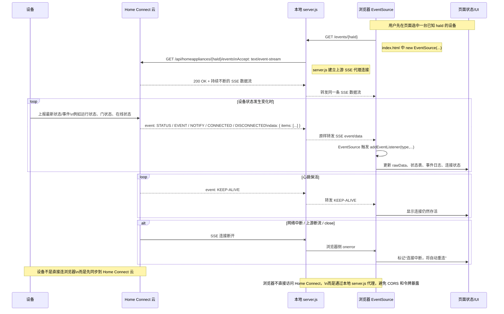
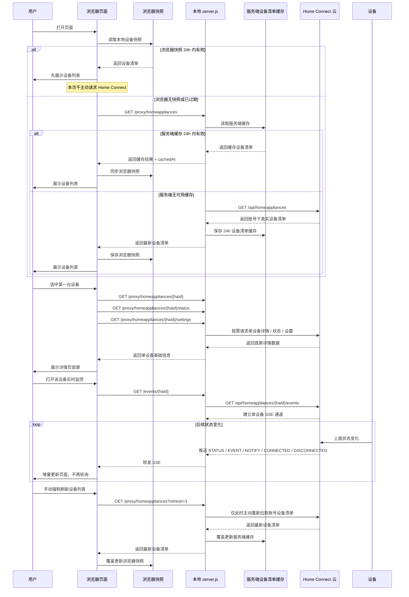

# GetDWinfo SSE 与设备清单数据流图

日期：2026-05-11

本文档保存两张关键时序图：

1. 单设备 SSE 链路时序图
2. 设备清单 24h 拉取与单设备 SSE 更新的组合数据流图

---

## 图 1：单设备 SSE 链路时序图

### 图 1 说明

- 设备必须先通过设备清单获得 `haId`，前端才能打开对应 SSE 通道。
- SSE 适合接收增量变化，不负责发现账号下有哪些设备。
- 浏览器不直接连 Home Connect，而是通过本地 `server.js` 转发。

---

## 图 2：设备清单 24h 拉取 + 单设备 SSE 更新的组合数据流图

### 图 2 说明

- 设备清单是低频数据，目标是回答“账号下有哪些设备”。
- 单设备详情是按需数据，目标是回答“这台设备当前的基础状态是什么”。
- 单设备 SSE 是高频增量数据，目标是回答“这台设备刚刚发生了什么变化”。
- 这三层组合后，可以把高频轮询降到最低，优先用缓存和 SSE，只有必要时才重新调用 Home Connect。